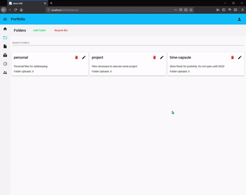
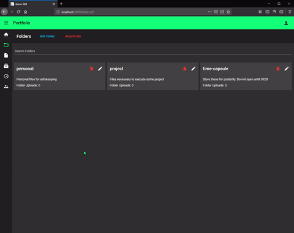
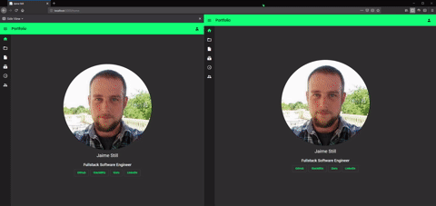
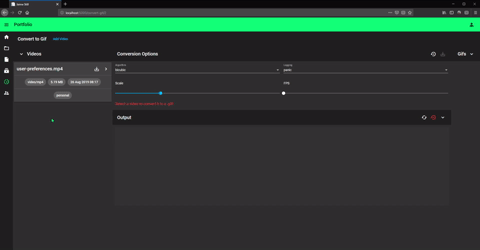
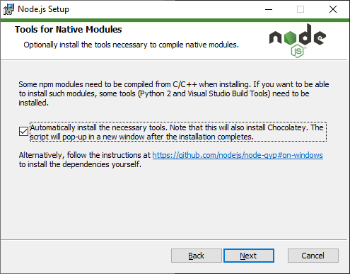
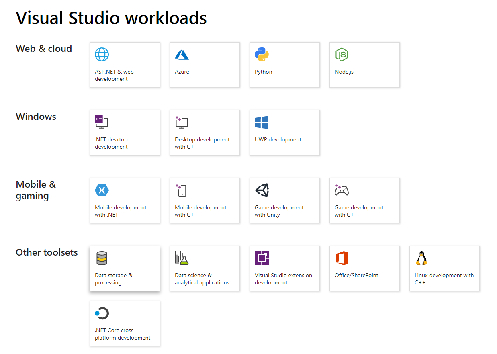
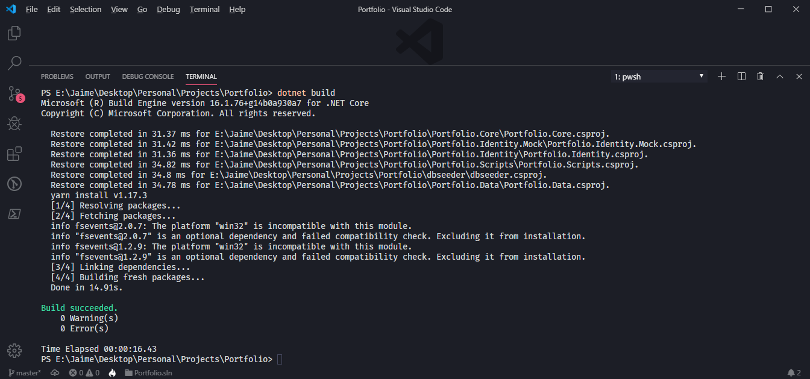
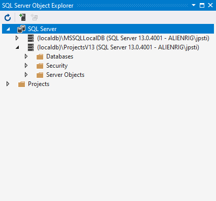
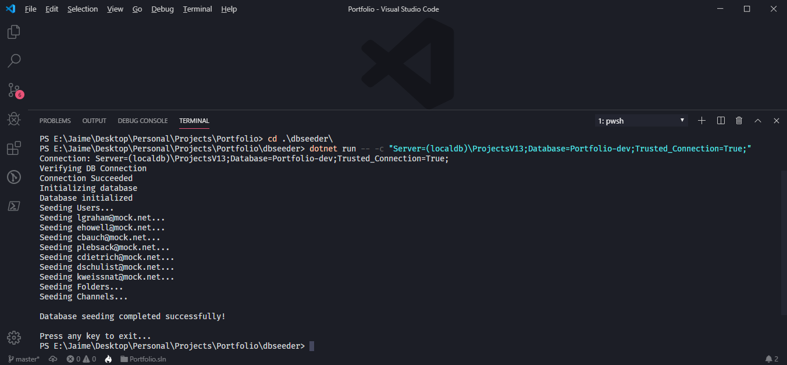
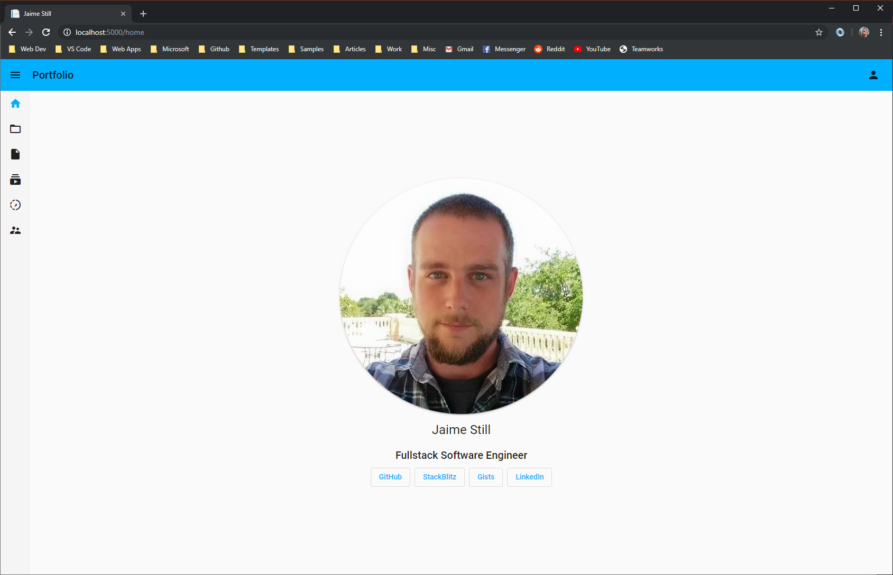

# Portfolio  

This project represents some of the core skills that I've developed as a full stack dev. It is intended to be run in a Windows environment.  

* [Features](#features)
* [Requirements](#requirements)
* [Build and Run](#build-and-run)

## Features  
[Back to Top](#portfolio)  

**User Preferences**  

[](./.images/07_user-preferences.gif)

**Folders**  

[localhost:5000/folders/{userId}](http://localhost:5000/folders/2)

[](./.images/08_folders.gif)  

> Note that all files uploaded while running this app are saved at `Portfolio\Portfolio.Web\wwwroot\files\`  

**Channels**  

[localhost:5000/channels](http://localhost:5000/channels)  

[](./.images/09_channels.gif)  

> You can run this demonstration in two different browser windows. Just be sure to test it using the same steps as used in GIF above. Changing the user in the session on the left will cause that user to become the user in the session on the right whenever it navigates to another route. This isn't the case when deployed to an Active Directory domain and unique user sessions are used, it's just built this way for testing outside of a domain environment.  

**Convert to GIF**  

[localhost:5000/convert-gif/{userId}](http://localhost:5000/convert-gif/2)  

[](./.images/10_gif-convert.gif)  

> All of the GIFs in this readme were generated using this!

## Requirements  
[Back to Top](#portfolio)  

* [.NET Core 2.2 SDK](https://dotnet.microsoft.com/download)
* [Node.js and npm](https://nodejs.org)
* [Yarn](https://yarnpkg.com)
* [Visual Studio 2019](https://visualstudio.microsoft.com/vs/)
* [Visual Studio Code](https://code.visualstudio.com)

### Notes  

When installing **Node.js** on Windows, make sure to check the option to install optinal dependencies with Chocolatey. It's the easiest way to integrate C++ build tools and Python into the CLI, and both are required for the `node-sass` client dependency.

[](./.images/01_node-chocolatey.png)

The only thing I use Visual Studio for is to manage SQL Server on my dev machine. When installing, the only workload needed is the **Data storage & processing** workload.  

[](./.images/02_vs-workloads.png)

## Build and Run  
[Back to Top](#portfolio)  

Open the **Portfolio** root folder in Visual Studio Code and in the **terminal**, execute the `dotnet build` command:

[](./.images/03_portfolio-build.png)

Before running the application, the database needs to be created and seeded with some starting data. If you have the **Data storage & processing** workload installed from Visual Studio, you should have the `(localdb)\ProjectsV13` SQL instance installed. This can be verified by adding it to **SQL Server Object Explorer** in Visual Studio:

[](./.images/04_sql-explorer.png)  

Change into the **dbseeder** directory and run the following:

``` cmd
dotnet run -- -c "Server=(localdb)\ProjectsV13;Database=Portfolio-dev;Trusted_Connection=True;"
```  

This will generate the database in the `(localdb)\ProjectsV13` instance, applying any Entity Framework migrations, and seed it with some initial data.

[](./.images/05_seed-data.png)  

Change into the **Portfolio.Web** directory, and execute the `dotnet run` command. This will host the application at [localhost:5000](http://localhost:5000).

[](./.images/06_portfolio.png)  

